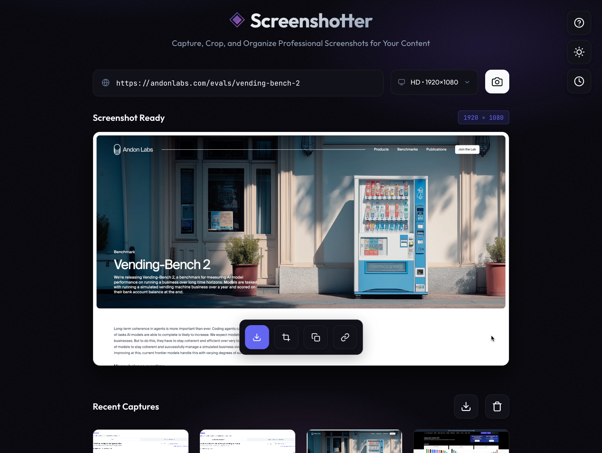

# Screenshotter



A powerful web-based tool for capturing professional screenshots of websites. Built with React 19 and Puppeteer, it features intelligent scrolling to capture specific page sections, automatic popup removal, client-side cropping, and persistent history.

**Live Demo**: [screenshotter.onrender.com](https://screenshotter.onrender.com)

## Features

### 📸 Screenshot Capture
- **Multiple Resolutions**: HD (1920×1080), Vertical/Stories (1080×1920), Full Page capture
- **Custom Sizes**: Define and save your own screenshot dimensions (up to 4K)
- **Batch Processing**: Capture multiple URLs at once (comma or line-separated)
- **Smart Scrolling**: Automatically navigate to URL hashtags and anchors, even on SPAs

### 🧹 Automatic Cleanup
- **Popup Removal**: Blocks cookie banners, newsletter popups, and consent dialogs
- **Request Interception**: Prevents popup scripts from loading (Iubenda, OneTrust, CookieBot, etc.)
- **DOM Cleanup**: Removes fixed overlays and modals before capture

### ✂️ Post-Capture Tools
- **Client-Side Cropping**: Crop any screenshot to focus on a specific area at full resolution
- **Download Options**: Download individual screenshots or batch download all as ZIP
- **Copy to Clipboard**: One-click copy for easy sharing
- **URL Retention**: Copy the original URL back for reference

### 💾 Persistence
- **Screenshot History**: Last 10 captures saved in local storage
- **Custom Resolutions**: Your custom sizes are remembered
- **Theme Preference**: Light/dark mode preference persists
- **Recent URLs**: Quick access to previously captured URLs

### 🎨 Modern UI
- **Light/Dark Mode**: Toggle between themes
- **Instant Tooltips**: Hover over any button for instant help
- **Responsive Design**: Works on desktop and mobile
- **Keyboard Shortcuts**: ⌘/Ctrl + Enter to capture

## Tech Stack

| Layer | Technology |
|-------|------------|
| Frontend | React 19, Vite 7 |
| Backend | Node.js, Express 5 |
| Automation | Puppeteer, @sparticuz/chromium |
| Libraries | react-image-crop, jszip, express-rate-limit |
| Deployment | Render |

## Installation

```bash
# Clone the repository
git clone https://github.com/planetoftheweb/Screenshotter.git
cd Screenshotter

# Install dependencies
npm install

# Start development server
npm run dev
```

- **Frontend**: http://localhost:5173
- **Backend**: http://localhost:3001

## Usage

### Basic Capture
1. Enter a URL in the input field
2. Select a resolution from the dropdown
3. Press ⌘/Ctrl + Enter or click the capture button

### Batch Capture
Enter multiple URLs separated by commas or newlines:
```
example.com
another-site.com/page
third-site.com/#section
```

### Capture Specific Sections
Use URL hashtags to capture specific page sections:
```
example.com/#pricing
example.com/#features
```

### Cropping
1. Capture a screenshot
2. Click the crop button
3. Drag to select the area you want
4. Click confirm to save the cropped version

## Project Structure

```
├── src/
│   ├── App.jsx       # Main React component
│   ├── App.css       # Styling (CSS variables for theming)
│   └── main.jsx      # React entry point
├── server/
│   └── index.js      # Express server + Puppeteer logic
├── render.yaml       # Render deployment config
├── agents.md         # AI agent context
├── CHANGELOG.md      # Version history
└── README.md         # This file
```

## Deployment

### Deploy to Render

1. Fork this repository
2. Create a new Web Service on [Render](https://render.com)
3. Connect your GitHub repo
4. Render will auto-detect `render.yaml` and configure everything

### Environment Variables

| Variable | Description | Default |
|----------|-------------|---------|
| `NODE_ENV` | Environment mode | `production` |
| `PORT` | Server port | `10000` (Render default) |

## Rate Limits

To prevent abuse, the API has built-in rate limiting:

| Limit | Value |
|-------|-------|
| Requests per minute | 5 per IP |
| Requests per hour | 30 per IP |
| URLs per batch | 5 max |
| Max resolution | 3840×2160 (4K) |

## API Endpoints

| Endpoint | Method | Description |
|----------|--------|-------------|
| `/api/screenshot` | POST | Capture a screenshot |
| `/api/limits` | GET | Get current rate limit configuration |

### POST /api/screenshot

```json
{
  "url": "https://example.com",
  "width": 1920,
  "height": 1080,
  "fullPage": false
}
```

## License

MIT

## Author

Ray Villalobos ([@planetoftheweb](https://github.com/planetoftheweb))
